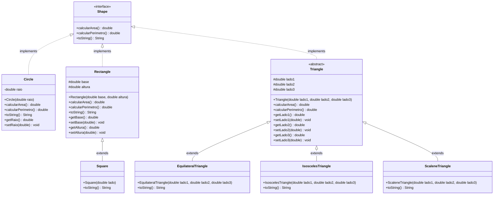

# Atividade #2 - OOP Introdução

## Descrição

Esta atividade implementa um sistema de cálculo de área e perímetro de figuras geométricas utilizando os conceitos de Programação Orientada a Objetos (POO), especificamente: **abstração**, **polimorfismo** e **herança**.

## Estrutura do Projeto

O projeto está organizado da seguinte forma:

```
Atividade 2 - OOP Introdução/
├── src/
│   ├── Shape.java                  # Interface base
│   ├── Circle.java                 # Classe Círculo
│   ├── Rectangle.java              # Classe Retângulo
│   ├── Triangle.java               # Classe abstrata Triângulo
│   ├── EquilateralTriangle.java    # Triângulo Equilátero
│   ├── IsoscelesTriangle.java      # Triângulo Isósceles
│   ├── ScaleneTriangle.java        # Triângulo Escaleno
│   ├── Square.java                 # Classe Quadrado (herda de Rectangle)
│   └── Main.java                   # Classe principal com testes
└── README.md
```

## Diagrama de Classes



## Conceitos de POO Utilizados

### 1. Abstração
- **Interface `Shape`**: Define o contrato comum para todas as figuras geométricas através de métodos abstratos (`calcularArea()` e `calcularPerimetro()`)

### 2. Herança
- **Classe `Triangle`**: Classe abstrata que serve como base para os três tipos de triângulos
- **Classes derivadas de `Triangle`**: `EquilateralTriangle`, `IsoscelesTriangle`, `ScaleneTriangle`
- **Classe `Square`**: Herda de `Rectangle`, reutilizando seus atributos e métodos

### 3. Polimorfismo
- Todas as classes implementam a interface `Shape`, permitindo tratar diferentes tipos de figuras de forma uniforme
- Método `toString()` sobrescrito em cada classe para fornecer representação específica de cada figura

## Descrição das Classes

### Interface Shape
Define os métodos que todas as figuras geométricas devem implementar:
- `calcularArea()`: Calcula a área da figura
- `calcularPerimetro()`: Calcula o perímetro da figura
- `toString()`: Retorna uma representação em string da figura

### Classe Circle
- **Atributos**: `raio` (double)
- **Área**: π × r²
- **Perímetro**: 2 × π × r

### Classe Rectangle
- **Atributos**: `base` (double), `altura` (double)
- **Área**: base × altura
- **Perímetro**: 2 × (base + altura)

### Classe Triangle (Abstrata)
- **Atributos**: `lado1`, `lado2`, `lado3` (double)
- **Área**: Fórmula de Heron
- **Perímetro**: lado1 + lado2 + lado3

### Classes Derivadas de Triangle

#### EquilateralTriangle
Triângulo com todos os lados iguais

#### IsoscelesTriangle
Triângulo com dois lados iguais

#### ScaleneTriangle
Triângulo com todos os lados diferentes

### Classe Square
- **Herda de**: `Rectangle`
- **Atributos**: Utiliza `base` e `altura` da classe pai (ambos iguais ao lado)
- **Construtor**: Recebe apenas o lado e chama `super(lado, lado)`

## Casos de Teste

### Teste 1: Círculo
```java
Circle circle = new Circle(5);
circle.toString()
```
**Saída esperada:**
```
Círculo, área: 78.540 perímetro: 31.4159
```

### Teste 2: Retângulo
```java
Rectangle rectangle = new Rectangle(15, 7);
rectangle.toString()
```
**Saída esperada:**
```
Retângulo, área: 105 perímetro: 44
```

### Teste 3: Triângulo Equilátero
```java
EquilateralTriangle triangle = new EquilateralTriangle(7, 7, 7);
triangle.toString()
```
**Saída esperada:**
```
Triângulo equilátero, área: 21.218 perímetro: 21
```

### Teste 4: Quadrado
```java
Square square = new Square(2);
square.toString()
```
**Saída esperada:**
```
Quadrado, área: 4 perímetro: 8
```

## Como Compilar e Executar

### Compilação
```bash
cd "Atividade 2 - OOP Introdução/src"
javac *.java
```

### Execução
```bash
java Main
```

## Resultados da Execução

```
=== TESTE DE FIGURAS GEOMÉTRICAS ===

Teste 1: Círculo
Círculo, área: 78.540 perímetro: 31.4159

Teste 2: Retângulo
Retângulo, área: 105 perímetro: 44

Teste 3: Triângulo Equilátero
Triângulo equilátero, área: 21.218 perímetro: 21

Teste 4: Quadrado
Quadrado, área: 4 perímetro: 8

Teste 5: Triângulo Isósceles
Triângulo isósceles, área: 12.000 perímetro: 16

Teste 6: Triângulo Escaleno
Triângulo escaleno, área: 6.000 perímetro: 12

=== TODOS OS TESTES CONCLUÍDOS ===
```

## Observações Técnicas

1. **Classe Triangle como Abstrata**: A classe `Triangle` foi implementada como abstrata, fornecendo a implementação comum do cálculo de área (fórmula de Heron) e perímetro, enquanto permite que as subclasses personalizem o método `toString()`.

2. **Herança de Rectangle para Square**: A classe `Square` herda de `Rectangle`, demonstrando que um quadrado é um caso especial de retângulo onde base = altura.

3. **Atributos Protected**: Os atributos em `Rectangle` e `Triangle` são `protected` para permitir acesso pelas classes filhas, mantendo o encapsulamento.

4. **Fórmula de Heron**: Utilizada para calcular a área de triângulos quando apenas os lados são conhecidos:
   - s = (a + b + c) / 2 (semiperímetro)
   - Área = √[s(s-a)(s-b)(s-c)]

## Conclusão

Esta implementação demonstra de forma clara e objetiva os conceitos fundamentais de Programação Orientada a Objetos:
- **Abstração** através da interface `Shape`
- **Herança** através das relações Triangle → subclasses e Rectangle → Square
- **Polimorfismo** através da implementação da interface `Shape` por todas as classes

O código está bem estruturado, documentado e pronto para extensões futuras.
