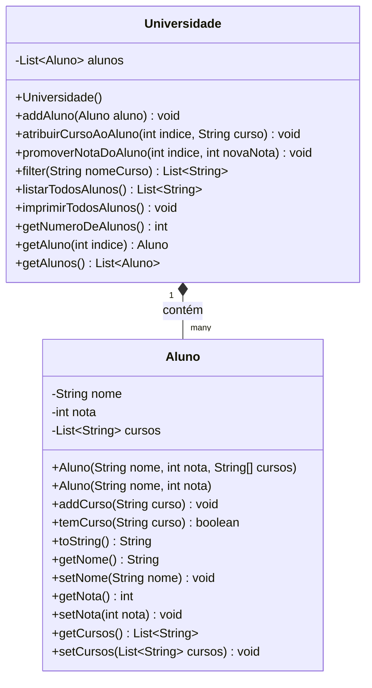

# Atividade #3 - OOP Combinada com Matrizes Simples

## Descrição

Esta atividade combina programação procedural com programação orientada a objetos, implementando um sistema de gerenciamento de alunos e cursos da Jala University. Utiliza os conceitos de **abstração** e **encapsulamento** através de classes com atributos privados e métodos de acesso (getters e setters).

## Estrutura do Projeto

```
Atividade 3 - OOP Combinada com Matrizes Simples/
├── src/
│   ├── Aluno.java           # Classe Aluno com encapsulamento
│   ├── Universidade.java    # Classe Universidade com matriz de alunos
│   └── Main.java            # Classe principal com testes
└── README.md
```

## Diagrama de Classes



## Conceitos de POO Utilizados

### 1. Encapsulamento
- Todos os atributos das classes são **privados** (`private`)
- Acesso aos atributos somente através de métodos públicos (getters e setters)
- Proteção dos dados internos das classes

### 2. Abstração
- Classe `Aluno` abstrai as características de um aluno (nome, nota, cursos)
- Classe `Universidade` abstrai uma instituição que gerencia uma lista de alunos

### 3. Programação Procedural com OOP
- Uso de estruturas de dados (Listas/Arrays) combinadas com objetos
- Operações sobre matrizes/coleções implementadas de forma orientada a objetos

## Descrição das Classes

### Classe Aluno

Representa um aluno da universidade com suas características e cursos.

#### Atributos (Privados)
- `nome` (String): Nome do aluno
- `nota` (int): Nota do aluno
- `cursos` (List<String>): Lista de cursos atribuídos ao aluno

#### Métodos Principais
- `addCurso(String curso)`: Adiciona um novo curso à lista do aluno
- `temCurso(String curso)`: Verifica se o aluno está matriculado em um curso
- `toString()`: Retorna representação formatada do aluno
- **Getters e Setters**: Métodos de acesso para todos os atributos

#### Encapsulamento
Todos os atributos são privados e acessíveis apenas através de métodos públicos, garantindo:
- Controle sobre como os dados são modificados
- Validação quando necessário
- Manutenção da integridade dos dados

### Classe Universidade

Representa a universidade que gerencia uma coleção de alunos.

#### Atributos (Privados)
- `alunos` (List<Aluno>): Lista de alunos matriculados

#### Métodos Principais

1. **`addAluno(Aluno aluno)`**
   - Adiciona um novo aluno à lista
   - Exemplo: `universidade.addAluno(new Aluno("Gery", 1, {"induction"}))`

2. **`atribuirCursoAoAluno(int indice, String curso)`**
   - Atribui um novo curso a um aluno específico
   - Exemplo: `universidade.atribuirCursoAoAluno(3, "DataBase I")`

3. **`promoverNotaDoAluno(int indice, int novaNota)`**
   - Atualiza a nota de um aluno
   - Exemplo: `universidade.promoverNotaDoAluno(0, 2)`

4. **`filter(String nomeCurso)`**
   - Filtra e retorna lista de nomes dos alunos de um curso específico
   - Exemplo: `universidade.filter("science")` → `["Luis", "Raul", "Liz"]`

5. **`listarTodosAlunos()`**
   - Retorna lista de strings formatadas com todos os alunos
   - Formato: `Nome: [nome], Nota: [nota], Curso: [curso1], [curso2], ...`

6. **`imprimirTodosAlunos()`**
   - Imprime todos os alunos no console no formato especificado

## Casos de Teste

### Teste 1: Adicionar Aluno
```java
universidade.addAluno(new Aluno("Gery", 1, new String[]{"induction"}));
```

### Teste 2: Atribuir Curso
```java
universidade.atribuirCursoAoAluno(3, "DataBase I");
```

### Teste 3: Promover Nota
```java
universidade.promoverNotaDoAluno(0, 2);
```

### Teste 4: Filtrar Alunos por Curso
```java
List<String> alunos = universidade.filter("science");
// Resultado esperado: ["Luis", "Raul", "Liz"]
```

### Teste 5: Listar Todos os Alunos
```java
universidade.imprimirTodosAlunos();
```

**Saída esperada:**
```
Nome: Gery, Nota: 2, Curso: induction
Nome: Luis, Nota: 2, Curso: science
Nome: Raul, Nota: 2, Curso: maths, science
Nome: Liz, Nota: 3, Curso: science, DataBase I
```

## Como Compilar e Executar

### Compilação
```bash
cd "Atividade 3 - OOP Combinada com Matrizes Simples/src"
javac *.java
```

### Execução
```bash
java Main
```

## Resultados da Execução

```
=== TESTE: UNIVERSIDADE JALA ===

1. Adicionando alunos à universidade:
   Alunos adicionados com sucesso!

2. Atribuindo curso 'DataBase I' ao aluno no índice 3:
   Curso adicionado!

3. Promovendo nota do aluno no índice 0 (Gery) de 1 para 2:
   Nota promovida!

4. Filtrando alunos do curso 'science':
   Alunos do curso 'science': [Luis, Raul, Liz]
   Resultado esperado: [Luis, Raul, Liz]

5. Listando todos os alunos:
Nome: Gery, Nota: 2, Curso: induction
Nome: Luis, Nota: 2, Curso: science
Nome: Raul, Nota: 2, Curso: maths, science
Nome: Liz, Nota: 3, Curso: science, DataBase I

=== TESTES ADICIONAIS ===

6. Filtrando alunos do curso 'maths':
   Alunos do curso 'maths': [Raul]

7. Filtrando alunos do curso 'induction':
   Alunos do curso 'induction': [Gery]

8. Total de alunos na universidade: 4

=== TODOS OS TESTES CONCLUÍDOS ===
```

## Observações Técnicas

### 1. Uso de List em vez de Array
- Utilizamos `List<String>` e `List<Aluno>` em vez de arrays tradicionais
- Isso permite operações mais flexíveis (adicionar, remover elementos)
- Mantém a compatibilidade com operações de matriz/coleção

### 2. Encapsulamento Rigoroso
- Todos os atributos são privados
- Métodos getters retornam cópias das listas para evitar modificação externa direta
- Setters permitem modificação controlada

### 3. Validação de Índices
- Métodos que recebem índices verificam se estão dentro dos limites válidos
- Previne erros de IndexOutOfBoundsException

### 4. Prevenção de Duplicatas
- Método `addCurso()` verifica se o curso já existe antes de adicionar
- Evita cursos duplicados na lista do aluno

### 5. Formatação de Saída
- Método `toString()` formatado conforme especificação
- Lista de cursos separada por vírgulas
- Formato consistente: `Nome: [nome], Nota: [nota], Curso: [cursos]`

## Estrutura de Dados

### Matriz de Cursos (Aluno)
- Cada aluno possui uma lista de cursos (List<String>)
- Permite múltiplos cursos por aluno
- Pode ser expandida dinamicamente

### Matriz de Alunos (Universidade)
- A universidade mantém uma lista de alunos (List<Aluno>)
- Permite adicionar/consultar alunos
- Suporta operações de filtro e listagem

## Conclusão

Esta implementação demonstra de forma eficiente a combinação de programação procedural (uso de estruturas de dados como listas/arrays) com programação orientada a objetos (encapsulamento, abstração). O código está bem estruturado, seguindo boas práticas de encapsulamento, e permite fácil extensão e manutenção.
